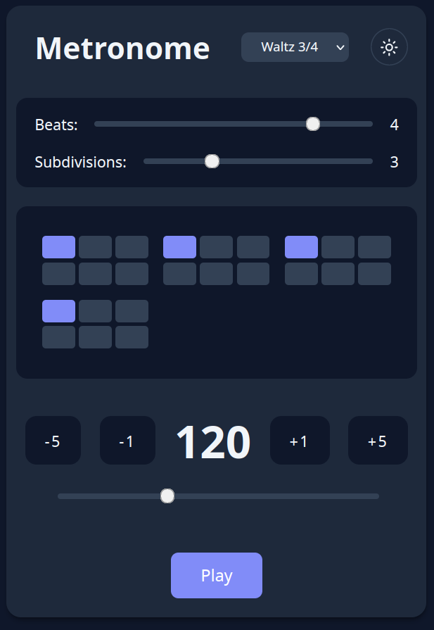

# Pattern Metronome

This is a simple metronome app, with programmable click patterns. You can try it [here](https://benterris.github.io/pattern-metronome/)

## Features
* Create custom patterns by tapping the grid
* Two available clicks
* Some preset patterns
* Adjust the number of beats per measure
* Adjust the number subdivisions per beat

